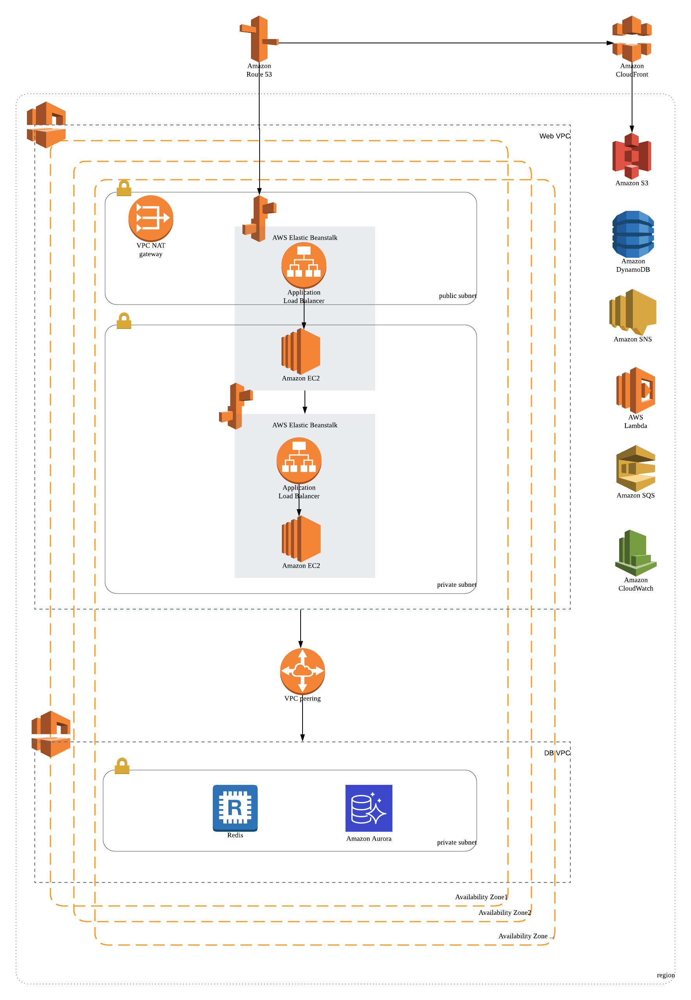
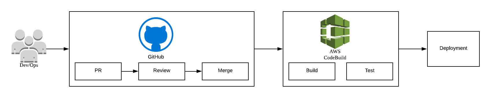

# Terraform IaC example

## Architecture


## CI/CD pipeline


## Requirements
- Virtualbox
- Vagrant

## Set for vagrant
### copy files, fill in contents
```sh
$ cp _provisioning/config.json.sample _provisioning/config.json
$ cp _provisioning/ansible/roles/common_tasks/files/rc.local.sample _provisioning/ansible/roles/common_tasks/files/rc.local
$ cp {rsa_public_key} _provisioning/ansible/roles/ssh/files/rsa/id_rsa.pub
$ cp _provisioning/ansible/roles/ssh/files/ssh/sshd_config.sample _provisioning/ansible/roles/ssh/files/ssh/sshd_config
```

## Run terraform
### initialize
```sh
$ terraform init
```
### confirm plan
```sh
$ terraform plan
```

### run
```sh
$ terraform apply
```

## [성능 최적화 경험 정리](docs/optimization.md)